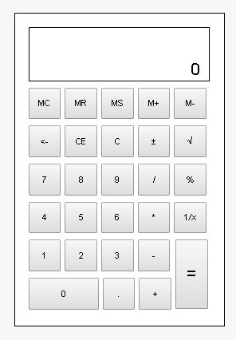

# windowsCalculatorHTML
##A mimic of the windows calculator built in HTML/CSS 
###Built for University of San Carlos IT 2103 Classes

###This project outputs a simple HTML/CSS Generated Calculator:

To Make Pull Request (make me see your code edits):
>[GitHub - How to Make a Pull Request](https://help.github.com/articles/creating-a-pull-request/)

